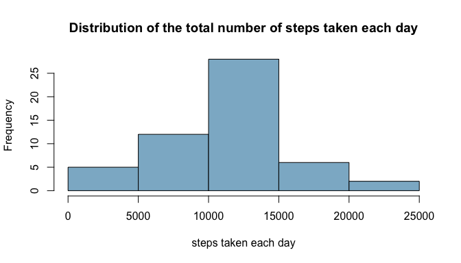
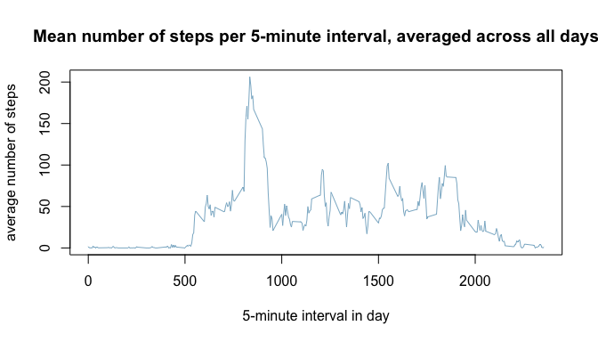
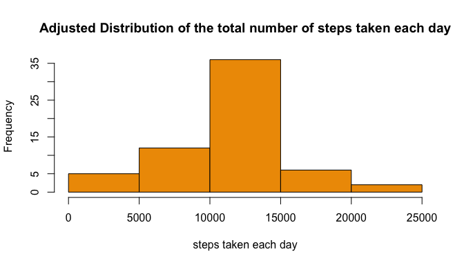

# Reproducible Research: Peer Assessment 1

0. Set Up Global Reporting Options

```r
# only use scientific notation for very large numbers
options(scipen = 10)
```

## Loading and preprocessing the data

1. Load the data

```r
unzip("activity.zip")

# Interpret the second column as dates
activity <- read.csv("activity.csv", colClasses = c(NA, "Date", NA))
```

2. Process/transform the data into a format suitable for analysis

```r
# clean cases
cleanActivity <- activity[complete.cases(activity),]
```

## What is mean total number of steps taken per day?

Note: for this section, we are ignoring missing values in the dataset

1. Calculate the total number of steps taken per day

```r
# aggregate steps by date, taking the sum
stepsPerDay <- aggregate(steps ~ date, cleanActivity, sum)
```

2. Histogram of the total number of steps taken each day

```r
hist(stepsPerDay$steps, 
     main="Distribution of the total number of steps taken each day",
     xlab="steps taken each day",
     col="lightskyblue3")
```

 

3. Calculate and report the mean and median of the total number of steps taken per day

```r
meanStepsPerDay <- mean(stepsPerDay$steps)
medianStepsPerDay <- median(stepsPerDay$steps)
```
* __Mean Steps Per Day__:   10766.1886792

* __Median Steps Per Day__: 10765

## What is the average daily activity pattern?

1. Time series plot of the 5-minute interval (x-axis) and the average number of steps taken, averaged across all days (y-axis)

```r
# aggregate steps by interval, taking the mean
meanStepsPerInterval <- aggregate(steps ~ interval, cleanActivity, mean)

plot(meanStepsPerInterval,
     type="l",
     main="Mean number of steps per 5-minute interval, averaged across all days",
     xlab="5-minute interval in day",
     ylab="average number of steps",
     col="lightskyblue3")
```

 

2. Which 5-minute interval, on average across all the days in the dataset, contains the maximum number of steps?

```r
intervalWithMaxAverageSteps <- meanStepsPerInterval[which.max(meanStepsPerInterval$steps),]$interval
```
* __5-minute interval with maximum number of steps, on average across all days__:   835

## Inputing missing values

Note: There are a number of days/intervals where there are missing values (coded as NA). The presence of missing days may introduce bias into some calculations or summaries of the data.

1. The total number of missing values in the dataset (i.e. the total number of rows with NAs)


```r
numRowsNa <- nrow(activity[!complete.cases(activity),])
```
* __Number of rows with missing values__:   2304

2. Identify a strategy for filling in all of the missing values in the dataset:

* __If the step value is missing, use the mean step value for the corresponding 5-minute interval, averaged across all days__

3. Create a new dataset that is equal to the original dataset but with the missing data filled in, using the above strategy.


```r
adjustedActivity <- activity
nrowsOfActivity <- nrow(activity)
for (i in 1:nrowsOfActivity) {
  if (is.na(activity[i, "steps"])) {
    adjustedActivity[i,"steps"] <- meanStepsPerInterval[meanStepsPerInterval$interval==activity[i, "interval"],"steps"]
  }
}
```

4.1 Histogram of the adjusted total number of steps taken each day.


```r
# aggregate steps by date, taking the sum
adjustedStepsPerDay <- aggregate(steps ~ date, adjustedActivity, sum)

hist(adjustedStepsPerDay$steps, 
     main="Adjusted Distribution of the total number of steps taken each day",
     xlab="steps taken each day",
     col="orange2")
```

 

4.2 Calculate and report the mean and median total number of steps taken per day (adjusted).

```r
adjustedMeanStepsPerDay <- mean(adjustedStepsPerDay$steps)
adjustedMedianStepsPerDay <- median(adjustedStepsPerDay$steps)
```
* __Adjusted Mean Steps Per Day__:   10766.1886792

* __Adjusted Median Steps Per Day__: 10766.1886792

4.3 Do these values differ from the estimates from the first part of the assignment? What is the impact of inputing missing data on the estimates of the total daily number of steps?

_The mean matches the estimate from the first part of the assignment, but the median has shifted.  The mean remains the same because our replacement strategy is to use the mean for existing values for each interval as the replacement for unkonwn values, which maintains the mean for that interval (averaging in a value equal to the current average maintains the average).  However, the median shifts as a result of replacing unknown values (as the median is the 50th percentile of all values, adding average values per interval where they did not exist, moves the median to equal the mean for the data set)._

## Are there differences in activity patterns between weekdays and weekends?
